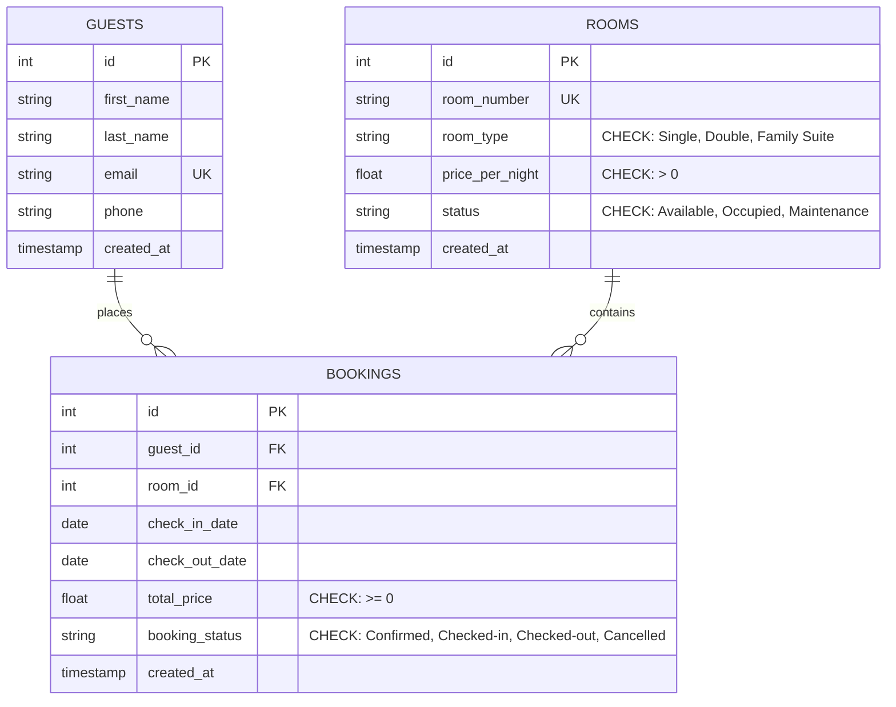

# Hotel Management System MVP

An educational, production-grade Hotel Management System MVP built with **FastAPI**, **SQLite**, and **Vanilla Web Technologies (HTML5 / CSS3 / JavaScript)**.

---

## Architecture Overview

```
hotel-management-system/
├── database.py             # Module 1: SQLite schema, PRAGMA foreign keys, and seed data
├── schemas.py              # Module 2: Pydantic input/output validation models & Enums
├── main.py                 # Module 3: FastAPI REST API, lifecycle handlers, endpoints
├── static/                 # Module 4: Vanilla Web Dashboard
│   ├── index.html          # Semantic HTML5 dashboard layout
│   ├── style.css           # Glassmorphism dark theme & responsive CSS grid
│   └── app.js              # Vanilla JS async fetch controllers & dynamic estimator
├── test_main.py            # Module 5: Automated Pytest test suite with isolated test DB
├── requirements.txt        # Frozen dependencies
├── hotel_management.db     # SQLite database instance
├── verify_db.py            # Schema integrity verification script
├── verify_schemas.py       # Pydantic models verification script
├── verify_api.py           # REST endpoints verification script
└── verify_dashboard.py     # Static asset delivery verification script
```

---

## Relational Schema (3NF)



---

## Quickstart Guide

### 1. Activate Virtual Environment
```powershell
.\.venv\Scripts\Activate.ps1
```

### 2. Run the Development Server
```powershell
.\.venv\Scripts\uvicorn.exe main:app --reload --port 8000
```

- **Web Dashboard**: Open [http://127.0.0.1:8000](http://127.0.0.1:8000)
- **Interactive API Docs (Swagger UI)**: Open [http://127.0.0.1:8000/docs](http://127.0.0.1:8000/docs)
- **Alternative ReDoc**: Open [http://127.0.0.1:8000/redoc](http://127.0.0.1:8000/redoc)

### 3. Run Automated Tests
```powershell
.\.venv\Scripts\pytest.exe -v test_main.py
```
