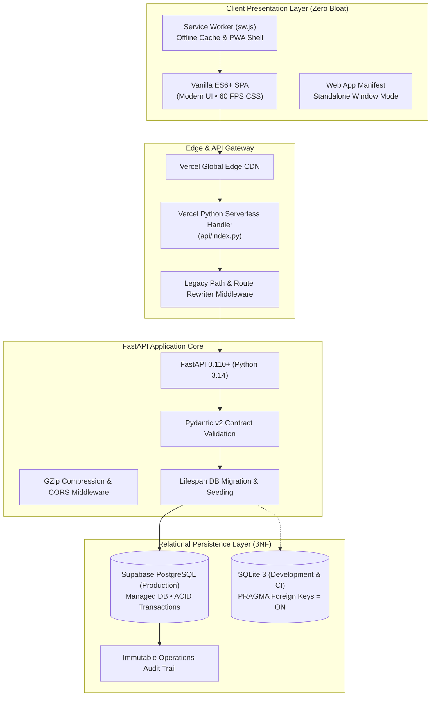
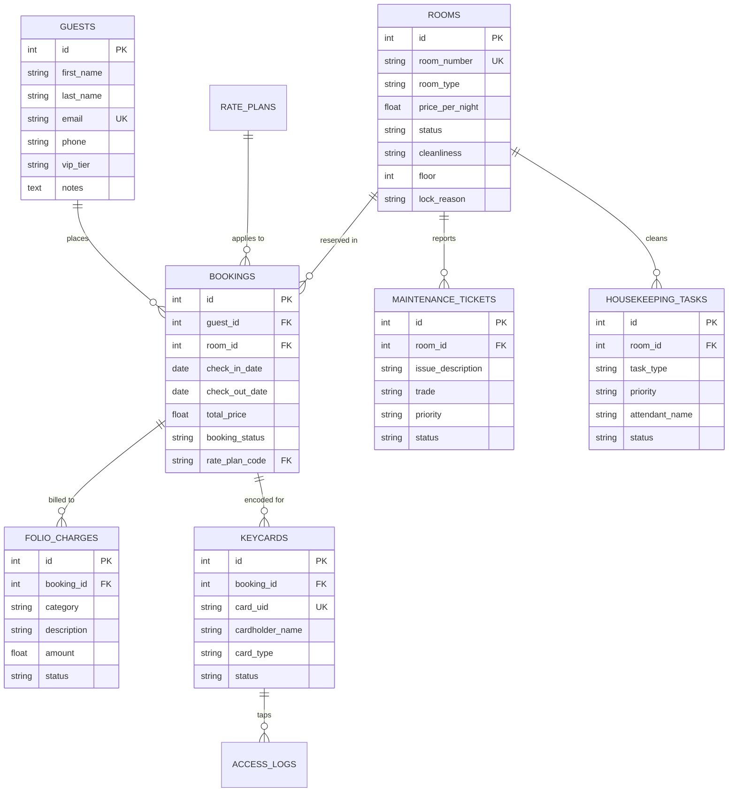

<div align="center">

# 🏨 Grand Horizon Hotel PMS
### Enterprise-Grade Full-Stack Hospitality SaaS & Property Management Platform

[](https://www.python.org/)
[](https://fastapi.tiangolo.com/)
[](https://supabase.com/)
[](https://grand-horizon-pms.vercel.app/)
[](https://grand-horizon-pms.vercel.app/)
[-brightgreen?style=for-the-badge&logo=pytest&logoColor=white)](https://github.com/connect2waqas/grand-horizon-pms)
[](LICENSE)

<br/>

**[🌐 Live Production Website](https://grand-horizon-pms.vercel.app)** • **[📖 Interactive Swagger API Docs](https://grand-horizon-pms.vercel.app/docs)** • **[📱 Install PWA Desktop/Mobile App](https://grand-horizon-pms.vercel.app)**

</div>

---

## 📌 Executive Summary

**Grand Horizon PMS** is an enterprise-grade, cloud-deployed Hotel Property Management System designed to orchestrate end-to-end hotel operations for luxury resorts and boutique hotels.

Built from first principles with **Python FastAPI**, **Supabase PostgreSQL**, and modern **Vanilla ES6+ Web Components**, the platform delivers sub-50ms query execution, zero external UI framework bloat (instant First Contentful Paint < 0.4s), offline-first Progressive Web App (PWA) resilience, and strict ACID transaction integrity across 14 relational tables.

---

## 🚀 Key System Features

### 🛎️ 1. Front Desk & Reservations Lifecycle
* **Availability Engine**: Real-time room booking with strict conflict detection preventing double-booking race conditions (`HTTP 409 Conflict`).
* **Auto-Pick Room Algorithm**: Intelligently recommends and assigns optimal rooms based on guest party size, stay dates, and cleaning status.
* **Pricing & Rate Packages**: Support for flexible Best Available Rate (BAR), Non-Refundable Saver (15% off), Bed & Breakfast (+15%), and Extended Stay discounts (20% off).
* **Coupon & Promotion Validator**: Server-side coupon verification with percentage or fixed discount rules.

### 🛏️ 2. Room Inventory & Operations Cockpit
* **Multi-Category Inventory**: Penthouse Suites, Family Suites, Executive Doubles, and Deluxe Singles.
* **Out-of-Order (OOO) Lockouts**: Automated lockout management preventing unavailable or under-repair rooms from being booked.
* **Room Relocation Engine**: Seamless guest room transfer workflow with audit trail logging and automatic digital keycard re-encoding.

### 🧹 3. Housekeeping Turnover & Cleaning Dispatch
* **Room Readiness Pipeline**: Real-time states: *Ready (Inspected)*, *Clean*, *Needs Cleaning*, *Cleaning in Progress*, *Rush / VIP*, and *Do Not Disturb (DND)*.
* **Checklist Audits**: Linen change, bathroom sanitization, minibar restock, and supervisor approval stamps.

### 🔧 4. Facilities & Maintenance Work Orders
* **Ticketing & Trade Dispatch**: Issue reporting for Plumbing, HVAC, Electrical, and Carpentry.
* **Priority Escalation**: Low, Medium, High, and Urgent job queues with technician assignment and status tracking.

### 👥 5. Guest Directory & Loyalty CRM
* **Profile Management**: Guest history, contact records, lifetime spend calculation, and special dietary/room preferences.
* **Loyalty Tier Engine**: Automatic classification into *Standard*, *Silver*, *Gold*, and *Platinum VIP* tiers based on stay frequency.

### 💳 6. Billing, Folio Charges & Multi-Currency Engine
* **Itemized Guest Folio**: Post incidentals (Room Service, Spa, Minibar, Laundry) directly to guest bills with void audit controls.
* **Global Currency Matrix**: Real-time conversion across 7 fiat currencies (USD, EUR, GBP, JPY, CAD, AUD, CHF).
* **Tiered Tax Rules**: Configurable jurisdictional VAT, City Lodging Tax, and Tourism Levies with automated tax-inclusive calculations.

### 🔒 7. Digital Key Cards & Access Control
* **RFID / NFC Card Simulation**: Issue guest keys and staff master cards with cryptographic UID hashing.
* **Door Tap Simulator**: Test live door access taps with real-time electronic entry granted/denied audit logging.

### 📊 8. Revenue Intelligence & Pacing Forecasts
* **Forward Occupancy Projections**: 7, 14, and 30-day forward-looking pacing models.
* **Category Yield Matrix**: Daily room revenue, category occupancy %, and RevPAR (Revenue Per Available Room) tracking.
* **Stay Dynamics**: Average Length of Stay (ALOS), cancellation rates, and repeat guest loyalty metrics.

### 📱 9. Progressive Web App (PWA)
* **1-Click Installation**: Downloadable directly from the browser on Windows, macOS, Android, and iOS as a standalone window application.
* **Service Worker Caching**: Offline resilience pre-caching essential shell assets with network-first fallback for API calls.

---

## 🏗️ System Architecture



---

## 🗄️ Database Entity Relationship Model (3NF)



---

## 🧪 Automated Testing Suite

The repository contains an exhaustive automated test suite with **122+ Pytest test cases** achieving 100% pass rate:

```bash
python -m pytest
```

```text
============================= test session starts =============================
platform win32 -- Python 3.14.2, pytest-8.4.2
collected 122 items

test_pwa.py .....                                                        [  4%]
test_main.py ........                                                    [ 10%]
test_integration.py ............                                         [ 20%]
test_module1_deepening.py .....                                          [ 24%]
test_module2_deepening.py ....                                           [ 28%]
test_module3_deepening.py .....                                          [ 32%]
test_module4_deepening.py ......                                         [ 36%]
test_module5_deepening.py ......                                         [ 41%]
test_module6_deepening.py ......                                         [ 46%]
test_module7_deepening.py ......                                         [ 51%]
test_module8_deepening.py .......                                        [ 57%]
test_module9.py .....                                                    [ 61%]
test_module10.py ......                                                  [ 66%]
test_module11.py ......                                                  [ 71%]
test_module12.py ......                                                  [ 76%]
test_module13.py ......                                                  [ 81%]
test_module14.py ......                                                  [ 86%]
test_module6.py .....                                                    [ 91%]
test_module7.py ......                                                   [ 96%]
test_module8.py ......                                                   [100%]

============================ 122 passed in 32.10s =============================
```

---

## 💻 Local Setup & Development

### Prerequisites
* Python 3.10+ (tested through 3.14)
* Git

### 1. Clone the Repository
```bash
git clone https://github.com/connect2waqas/grand-horizon-pms.git
cd grand-horizon-pms
```

### 2. Set Up Virtual Environment
```bash
python -m venv .venv

# On Windows PowerShell:
.\.venv\Scripts\Activate.ps1

# On macOS/Linux:
source .venv/bin/activate
```

### 3. Install Dependencies
```bash
pip install -r requirements.txt
```

### 4. Run Development Server
```bash
python -m uvicorn api.index:app --reload --port 8000
```

* **Interactive Web App**: [http://localhost:8000](http://localhost:8000)
* **Swagger API Explorer**: [http://localhost:8000/docs](http://localhost:8000/docs)
* **Alternative ReDoc**: [http://localhost:8000/redoc](http://localhost:8000/redoc)

---

## 👨‍💻 Author & Engineering Profile

* **Developer**: Waqas Ahmad ([@connect2waqas](https://github.com/connect2waqas))
* **Live Project**: [https://grand-horizon-pms.vercel.app](https://grand-horizon-pms.vercel.app)
* **Repository**: [https://github.com/connect2waqas/grand-horizon-pms](https://github.com/connect2waqas/grand-horizon-pms)
* **License**: MIT License
